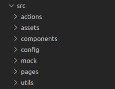

# Art Marketplace

<!-- PROJECT SHIELDS -->

[![Forks][forks-shield]][forks-url]
[![Stargazers][stars-shield]][stars-url]
[![Issues-open][issues-open-shield]][issues-url]
[![Issues-closed][issues-closed-shield]][issues-url]
[![Contributors][contributors-shield]][contributors-url]

<!-- PROJECT LOGO -->

|                                                   Art Marketplace                                                |
| :------------------------------------------------------------------------------------------------------: |
|                                              ![app-icon][]                                               |
|Azordev's art markeplace|
|                          [🐞 Report a bug or 🙋‍♂️ request a feature][issues-url]                           |
| [![contributions welcome][contributions-welcome]][issues-url] [![License][badge-apache]][apache-license] |

- [Art Marketplace](#art-marketplace)
  - [Art Marketplace Docs](#art-marketplace-docs)
    - [Features](#features)
    - [Built With](#built-with)
  - [Pre requirements](#pre-requirements)
  - [How to run the project:](#how-to-run-the-project)
  - [Create a .env file](#create-a-env-file)
  - [Technologies:](#technologies)
  - [Advantages Of TailwindCSS](#advantages-of-tailwindcss)
  - [File Structure:](#file-structure)
  - [GIT USE:](#git-use)
  - [FAQ:](#faq)
    - [Available Scripts](#available-scripts)
      - [`npm start`](#npm-start)
      - [`npm run build`](#npm-run-build)
    - [Learn More](#learn-more)
  - [Potential Features](#potential-features)
  - [Collaborators](#collaborators)
  - [Contributing](#contributing)
  - [Show your support](#show-your-support)
  - [License](#license)

## Art Marketplace Docs

A place where you can find a download Art images

### Features

![javascript][]
![react][]

- Basic `create-react-app` structure
- Sets `stylelint` on the repo
- Sets `eslint` rules
- Linters
- React
- React-DOM
- React-Create-App
- PropTypes
- ES6 syntax
- Export/import ES6+ notation

### Built With

- `create-react-app`
- `ESLint`
- `pnpm` 6.20.3 +
- `vscode` with _ESLint_ extension
- Linux/GNU, macOS, Windows
- Love and Passion for code

## Pre requirements

Before to start you need have some requirements:

1. [Node.js](https://nodejs.org/) > v14.0.0

   Node.js is a runtime environment for Javascript that allows us to use the language outside of the browser, in this case we use it to configure and run the development server.

2. [npm](https://www.npmjs.com/) > v6.0.0

   npm is a package manager for Node.js and comes installed with it, we use it to install and manage application dependencies.

3. [Git](https://git-scm.com/) > v2.0.0

   Git is a version control system for code, we use it to manage the different branches of the code.

4. Connection to internet

5. [Visual Studio Code](https://code.visualstudio.com/) or another code editor (optional)

## How to run the project:

1. Clone the repository

```
git clone https://github.com/Azordev/art-marketplace.git
```

2. Go to the project folder

```
cd art-marketplace
```

3. Install dependencies

```
npm install
```

or

```
yarn install
```

4. Run

```
npm start
```

or

```
yarn start
```

After executing any of the above commands, a development server will start; generally on port 3000. You must go to your browser and enter [localhost:3000](localhost:3000) and you will have access to the project.

## Create a .env file

- Copy the `.env.example` file in a new `.env.development` or `.env.production` file
- Put the correct values at the example. If you don't know about the correct keys, ask to the project leader about it

## Technologies:

The project has been developed using various technologies. Some of them are:

**React:**
For the front, React has been used, which is a powerful framework that allows us to interact dynamically with the DOM and encapsulate tons of functionalities through components. [React Docs](https://reactjs.org/docs/getting-started.html).

**TailwindCSS:**
Too we have used TailwindCSS, which is a CSS framework that help a lot with the CSS giving utilities classes and other tools to do the CSS more friendly for developers. [Tailwind Docs](https://tailwindcss.com/docs/installation) 

**Axios:**
Axios is a library that serves to create HTTP requests that are present externally. This ease the way to get data that isn't at the website else that is get from some API.

**EsLint:**

We like that our projects handle a clean code; that's why every time you commit & push, EsLint will analyze your input to make sure it complies with best practices.

## Advantages Of TailwindCSS

- Control Over Styling: Tailwind is a unique CSS framework when it comes to styling web applications, meaning that Tailwind does not have a default theme that you have to use like other CSS frameworks. For example, you can give each project a different look even if you use the same elements (color palette, size, etc.). Therefore, it’s one of the few CSS frameworks that is not opinionated on how you should style your project.
- Faster CSS Styling Process: There is no faster framework than Tailwind when it comes to styling HTML. As a result, you can easily create good-looking layouts by styling elements directly. This is possible because Tailwind offers thousands of built-in classes that do not require you to create designs from scratch.
- Minimum size of file: Tailwind CSS works in the front end of a website. For this reason, it is reasonable for developers to demand ultimate responsiveness. Well, Tailwind provides the ability to create responsive themes for your web applications and remove all unused CSS classes. With PurgeCSS, Tailwind helps you keep your final CSS as small as possible.

## File Structure:

The magic of the project happens inside the src folder. It is there where you will find all the components, pages and styles.

<table border="0">
    <td width="300px">
        
    </td>
    <td>
        <b>assets:</b> In this folder we place all the graphic resources. If you need to add / use a new image, this is the site.<br/><br/>
        <b>components:</b> The components are functionalities that we can reuse in many parts of our project. For example, if we need a button; we develop it only once and then we can call it as many times as we need it. We like to separate styles from logic and structure. That is why in this folder you will find styled components that are then used in the layout file.<br/><br/>
        <b>pages:</b> Here we place the structure of each section of the project and it is where we mostly use the components<br/><br/>
        <b>actions:</b> Axios work using instances, is here where the axios instances are used to call the data from the API server and is returned processed to the FrontEnd.<br/><br/>
        <b>config:</b> Is here where the instances of axios are configured.<br/><br/>
        <b>mock:</b> At this folder we save the mock data used for test.<br/><br/>
        <b>styles:</b> Here we get the global styles that we can use throughout the project.    
    </td>
</table>

## GIT USE:

There are some rules that apply when interacting with the project repository. This will allow us to have a standard that any developer can understand. It is important to comply with these rules so that the linting tool allows us to use the repository.

**Branch:**

Every time an issue is assigned to you, you must create a new branch. This can be done through the command:

```
git branch <name of branch>
```

For convenience, the branches should have a defined structure. For example, if the issue is about adding a new feature, the branch should be:

```
feature/#issuenumber-brief-description-of-the-feature
```

Suppose we have issue #12 that asks us to add a header to the main page. Then, the branch would be as follows:

```
feature/#12-add-header-to-main-page
```

If it is about solving a bug, we just have to put the word "fix" in front of it. For example:

```
fix/#14-remove-bad-media-queries-in-rating-component
```

**Commits:**

Like branches, commits must also follow a format. Notice how the commit message varies if it is a feature or a bug fix.

**feat**: added header to main page

**fix**: removed bad media queries in rating component

**Pull Request (PR):**

The PR’s are requests that as developers we make once the solution of an issue is completed and we want the code to be integrated into the master branch of the project. Before that, we must ensure that our code is fully functional and adhering to best practices.

Once we have done a commit & push in our branch, a notification with a yellow background will appear in the github repository and will ask us to continue with the PR. In the TextArea to perform the PR you will find several sections that you want to complete: A brief description of what you did, a snapshot (if applicable), the tasks that were completed and the steps to view them.

## FAQ:

**How do I create a new component?**

In the component folder, create a new file with the .jsx extension. Make sure to put an appropriate name to the functionality that you are going to develop.

### Available Scripts

In the project directory, you can run:

#### `npm start`

Runs the app in the development mode.
Open [http://localhost:3000](http://localhost:3000) to view it in the browser.

The page will reload if you make edits.
You will also see any lint errors in the console.

#### `npm run build`

Builds the app for production to the `build` folder.
It correctly bundles React in production mode and optimizes the build for the best performance.

The build is minified and the filenames include the hashes.
Your app is ready to be deployed!

See the section about [deployment](https://facebook.github.io/create-react-app/docs/deployment) for more information.

### Learn More

You can learn more in the [Create React App documentation](https://facebook.github.io/create-react-app/docs/getting-started).

To learn React, check out the [React documentation](https://reactjs.org/).

## Potential Features

- [ ] \<Insert your great idea here!>.

## Collaborators

| [Israel Laguan][author-github] | ![email-icon][] Email me to [contact@israellaguan.com][author-email] / ![linkedin-icon][] Connect to [my Linkedin][author-linkedin] |
| :----------------------------: | :---------------------------------------------------------------------------------------------------------------------------------: |
|        ![author-pic][]         |                                                                                                                          |
|  [Victor Peña][victor-github]  |  ![email-icon][] Email me to [victordev2002@gmail.com][victor-email] / ![linkedin-icon][] Connect to [my Linkedin][victor-linkedin]    |
|        ![victor-pic][]         |                                                                                                                          |
|[Emmanuel Azócar][emmanuel-github]|                          ![email-icon][] Email me to [azocarmel@gmail.com][emmanuel-email]                                       |
|        ![emmanuel-pic][]        |                                                                                                                          |
| [Angelica Molina][ange-github] |                              ![email-icon][] Email me to [angeli.molina1@gmail.com][ange-email]                                     |
|         ![ange-pic][]         |                                                                                                                          |
|[Roman Rodriguez][roman-github] |                            ![email-icon][] Email me to [romanrodri192@gmail.com][roman-email]                                       |
|         ![roman-pic][]          |                                                                                                                          |
|    [Tony Tarco][tony-github]   |                              ![email-icon][] Email me to [tonytarco@hotmail.com][tony-email]                                        |
|          ![tony-pic][]         |                                                                                                                          |
|[Ildebrando Quinchoa][ild-github]|                           ![email-icon][] Email me to [ildebrandoefrain@gmail.com][ild-email]                                      |
|          ![ild-pic][]          |                                                                                                                          |
|  [Eghinner Hernandez][eghinner-github]  |  ![email-icon][] Email me to [eghinner@gmail.com][eghinner-email] / ![linkedin-icon][] Connect to [my Linkedin][eghinner-linkedin]    |
|        ![eghinner-pic][]         |                                                             ![banner-eghinner][]                                                             |


## Contributing

[![contributions welcome][contributions-welcome]][issues-url]

🤝 Contributions, issues and feature requests are welcome!
Feel free to check the [issues page][issues-url].

## Show your support

🤗 Give a ⭐️ if you like this project!

- <https://blog.logrocket.com/deep-dive-into-lefthook-react-native/>
- <https://blog.logrocket.com/build-robust-react-app-husky-pre-commit-hooks-github-actions/>
- Favicon from [favicon.io](https://favicon.io/emoji-favicons/)
- <https://www.seoptimer.com/meta-tag-generator>
- <https://dev.to/nitzano/linting-docker-containers-2lo6?utm_source=lefthook>

## License

[![License][badge-apache]][apache-license]

📝 This project is licensed under the [Apache 2](LICENSE)\
Feel free to fork this project and improve it!

<!-- MARKDOWN LINKS & IMAGES -->

[victor-github]: https://github.com/Katsu08
[victor-pic]: https://avatars.githubusercontent.com/u/66505715?v=4
[victor-email]: mailto:victordev2002@gmail.com
[victor-linkedin]: https://www.linkedin.com/in/v%C3%ADctor-pe%C3%B1a-348a3918a/

[emmanuel-github]: https://github.com/e-azocar
[emmanuel-pic]: https://avatars.githubusercontent.com/u/61360270?v=4
[emmanuel-email]: mailto:azocarmel@gmail.com

[roman-github]: https://github.com/romanrguez192
[roman-pic]: https://avatars.githubusercontent.com/u/69876913?s=200&v=4
[roman-email]: mailto:romanrodri192@gmail.com

[tony-github]: https://github.com/Tonytarco
[tony-pic]: https://avatars.githubusercontent.com/u/37258801?s=200&v=4
[tony-email]: mailto:tonytarco@hotmail.com

[ange-github]: https://github.com/angelik0828
[ange-pic]: https://avatars.githubusercontent.com/u/4030477?s=200&v=4
[ange-email]: mailto:angeli.molina1@gmail.com

[ild-github]: https://github.com/ildebr
[ild-pic]: https://avatars.githubusercontent.com/u/73916430?v=4
[ild-email]: mailto:ildebrandoefrain@gmail.com

[eghinner-github]: https://github.com/Eghinner
[eghinner-pic]: https://avatars.githubusercontent.com/u/71513679?v=4
[eghinner-email]: mailto:eghinner@gmail.com
[eghinner-linkedin]: https://www.linkedin.com/in/eghinner


[contributors-shield]: https://img.shields.io/github/contributors/Azordev/art-marketplace?style=for-the-badge
[contributors-url]: https://github.com/Azordev/art-marketplace/graphs/contributors

[forks-shield]: https://img.shields.io/github/forks/Azordev/art-marketplace?style=for-the-badge
[forks-url]: https://github.com/Azordev/art-marketplace/network/members

[stars-shield]: https://img.shields.io/github/stars/Azordev/art-marketplace?style=for-the-badge
[stars-url]: https://github.com/Azordev/art-marketplace/stargazers

[issues-open-shield]: https://img.shields.io/github/issues/Azordev/art-marketplace?style=for-the-badge
[issues-closed-shield]: https://img.shields.io/github/issues-closed/Azordev/art-marketplace?style=for-the-badge

[react]: https://img.shields.io/badge/React-16+-61DAFB?style=for-the-badge&logo=react
[javascript]: https://img.shields.io/badge/JAVASCRIPT-ES6%2B-F7DF1E?style=for-the-badge&logo=javascript
[css]: https://img.shields.io/badge/style-CSS-1572B6?style=for-the-badge&logo=css3
[contributions-welcome]: https://img.shields.io/badge/contributions-welcome-brightgreen.svg?style=for-the-badge
[issues-url]: https://github.com/Azordev/art-marketplace/issues
[badge-apache]: https://img.shields.io/badge/License-Apache%202.0-blue.svg?style=for-the-badge
[apache-license]: https://opensource.org/licenses/Apache-2.0
[author-pic]: https://avatars2.githubusercontent.com/u/36519478?s=460&v=4
[author-github]: https://israel-laguan.github.io
[author-linkedin]: https://www.linkedin.com/in/israellaguan
[author-email]: mailto:contact@israellaguan.com
[linkedin-icon]: https://img.icons8.com/color/20/000000/linkedin.png
[email-icon]: https://img.icons8.com/color/20/000000/message-squared.png
[banner]: https://github.com/Israel-Laguan/Israel-Laguan/raw/master/docs/banner.jpg
[banner-eghinner]: https://github.com/Eghinner/Eghinner/raw/main/docs/Banner-EghinnerDev.png
[app-banner]: docs/app-banner.png
[app-icon]: public/logo.png
[icons8]: https://icons8.com/
[icons8-logo]: https://img.icons8.com/fluent/20/000000/icons8-new-logo.png
[api-logo]: https://spoonacular.com/images/spoonacular-logo-b.svg
